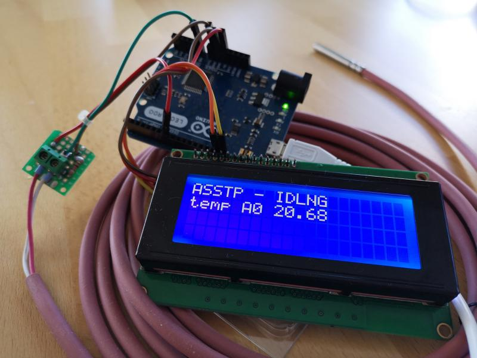

## Arduino Serial State Temperature Probes

### Introduction
Arduino Serial State Temperature Cable Probes (ASSTP) drives Negative and Positive Temperature Coefficient (NTC & PTC; [thermistors](https://en.wikipedia.org/wiki/Thermistor)) probes on all available _analog inputs_, may display those on some _I2C_ driven _LCD display_, and cycles a _state machine_ that allows for remote controlling via _serial port_; e.g. using USB.

Two projects are combined for ASSTP:

  - [cool Arduino Serial State Machine (coolASSM)](https://github.com/graetz23/coolArduinoSerialStateMachine),
  - [cool Arduino Temperature Probes (coolATP)](https://github.com/graetz23/coolArduinoTempProbes),

and extended by _extra serial commands_ to allow for remotely requesting values of the six temperatures cable probes (TPs).

### Building
For building the HEX file, the [arduino Makefile](https://github.com/sudar/Arduino-Makefile) is used. Clone or download / unzip to your system and configure the _Makefile_ to your arduino board and where you have installed _arduino Makefile_ type: _make_. Alternatively you can include all files of this project in your [arduino IDE](https://www.arduino.cc/en/main/software).

### Hardware
Wire your NTC probe with a _matching_ (same resistor value as the probe) resistor in series. Wire from the mid (between your probe and your resistor) of this _voltage divider_ to an _analog_ input of your arduino. Wire the _5 V_ (not system's volatage - there are two _5 V_ voltage sources) and GND to the ends of your _voltage divider_.

However there are several public _posts_, _blogs_, and _vlogs_ on internet showing a schematic wiring diagram; _try searching_ for: _NTC arduino_ or _PTC arduino_.

I also designed a **PCB prototype shield** for arduino **UNO**, and **leonardo**.

I it keeping _six_ NTC, where five have _cable glands_ for cabled NTC probes and the sixth has solder eyes for an internal NTC probe. It has a 5 mm _heartbeat_ LED for the serial state machine, where one can see the state of the machine: constantly on - ERROR, heartbeat - IDLE, and flickering - processing some RUN MODE state.

 Additionally theres a regulated power suppler, fed by up 18 V (even 37 V) that allows to regulated the volatage for electronics up to 5.87 V in maximum - to boost some device with 5.2 V to 5.4 V instead receiving 4.8 V from some week usb hub. ;-)

### Usage
Flash arduino, afterwards open a _serial client_, e.g. the _serial monitor (press CTRL+SHFT+m)_ of your arduino IDE. arduino is in STATE: _IDLE_ and waits for retrieving _COMMANDS_ from you. _COMMANDS_ have the syntax: <CMD_ID>; e.g. <2>, <3>, and so on; a listing of _all COMMANDS_ is [here](https://github.com/graetz23/coolArduinoSerialStateMachine#usage). arduino will reply in _IDLE_ to some of these _COMMANDs_; just try for.

However, for reading the temperature values of _analog input A0_, try:

  0. **<10>** ask _optionally_ for _STATUS_, and arduino should reply with: **<IDLE/>**; the current state,
  1. **<11>** tells arduino to go to another state: run _MODE1_; which is _overloaded_,
  2. **<40>** requests arduino to send _°C_ value of CTP at A0: **<A0>22.789</A0>**.

For any other analog input: A1, A2, ,A5, try sending while in run _MODE1_: **<41>, <42>, ..,<45>**.

The _extended_ COMMAND list by this project:

  - **<40>** request temperature value in degree celsius (°C) of analog input **A0**,
  - **<41>** request temperature value in degree celsius (°C) of analog input **A1**,
  - **<42>** request temperature value in degree celsius (°C) of analog input **A2**,
  - **<43>** request temperature value in degree celsius (°C) of analog input **A3**,
  - **<44>** request temperature value in degree celsius (°C) of analog input **A4**,
  - **<45>** request temperature value in degree celsius (°C) of analog input **A5**,

if **arduino is processing** in run **MODE1**; general COMMAND: **<11>**.

For more details, see [coolSSATP.ino](https://github.com/graetz23/ArduinoSerialStateTempProbes/blob/master/ASSTP.ino) file as _outer world usage_ example. For an _own adapation_, e.g. for driving another type / size of LCD display, take a look to the _inner world_, see the [ASSTP.cpp](https://github.com/graetz23/ArduinoSerialStateTempProbes/blob/master/ASSTP.cpp) and also [coolATP.cpp](https://github.com/graetz23/coolArduinoTempProbes/blob/master/coolATP.cpp) as how to change things inside.

### Releases

The following stable **releases** of ASSTP [are available](https://github.com/graetz23/ArduinoSerialStateTempProbes/releases):

  - **v1.2** - renamed repo \& porject to Arduino Serial State Temp Probes.
  - **v1.1** - changed _analog_ IDs from 7x to 4x; e.g. <40> .. doin' leetspeak.
  - **v1** - driving a I2C 16x2 LCD display additionally.

**Try cloning** (git checkout \<SHA\>) or **download** and unzip **from** [**release page**](https://github.com/graetz23/ArduinoSerialStateTempProbes/releases).

### Remarks
I will use this project for driving several NTC probes in a home brewery system to monitor the temperatures independently, only using arduino and a 20x4 LCD display. The _brewery automation_ is driven by a _raspberry pi 2B_ running [**CraftBeerPi3**](https://github.com/Manuel83/craftbeerpi3 (CBP3)). I am currently writing a [python](https://www.python.org/) plugin for CBP3: [craftbeerpi3ArduinoTempProbes](https://github.com/graetz23/craftbeerpi3ArduinoTempProbes) using [coolPSSM](https://github.com/graetz23/coolPythonSerialStateMachine) as a basis for communicating with arduino; coolPSSM is the python aquivalent that runs on ardiono as a basis [coolASSM](https://github.com/graetz23/coolArduinoSerialStateMachine).

Everything was coded using:

  - [**atom**](https://atom.io/) editor,
  - [**arduino Makefile**](https://github.com/sudar/Arduino-Makefile) for automated building,
  - [**arduino IDE**](https://www.arduino.cc/en/main/software) for serial monitor,
  - [**Gnome**](https://www.gnome.org/) as window manager,
  - and [**debian**](https://www.debian.org/) GNU/Linux.

have fun :-)

## ChangeLog

**20200405**
  - renamed project

**20200404**
  - changed COMMANDs from <7x> to <4x>
  - updated [coolASSM](https://github.com/graetz23/coolArduinoSerialStateMachine)
  - updated [coolPSSM](https://github.com/graetz23/coolPythonSerialStateMachine):
    - coolPSSM request in a loop analog data A0 from this project flashed to arduino.

**20200402**
  - matching to coolASSM verions 20200402:
    - in _coolASSM_: method _running_ was deprecated and removed,
    - in _coolASSM_: methods _runMODE1, runMODE2, .., runMODE7_ were added instead,
    - _overloaded_ method _runMODE1_ instead of _running_
  - added signaling on built in LED (PIN 13) of several states:
    - ERROR the LED is contantly on,
    - IDLE the LED does a heartbeat with 60 bpm,
    - and for all run MODEs, the LED flashes by 10 milliseonds.
  - added photo of my _test bench_ ;-)
  - creating README.md.

**20200331**
  - adding MIT License to all files.
  - adding the README.md for explanation,
  - setting up reository on [github.com](https://github.com/graetz23/ArduinoSerialStateTempProbes).
